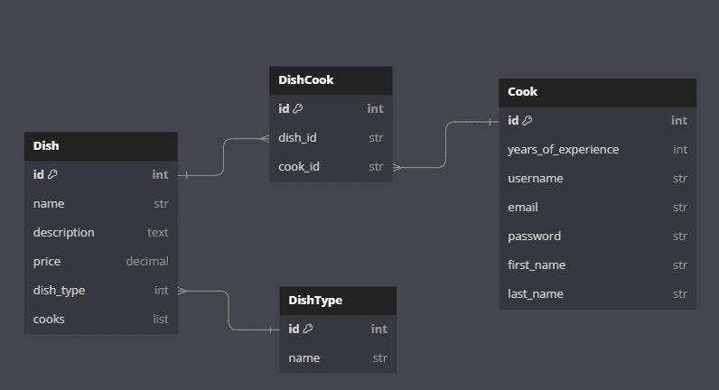
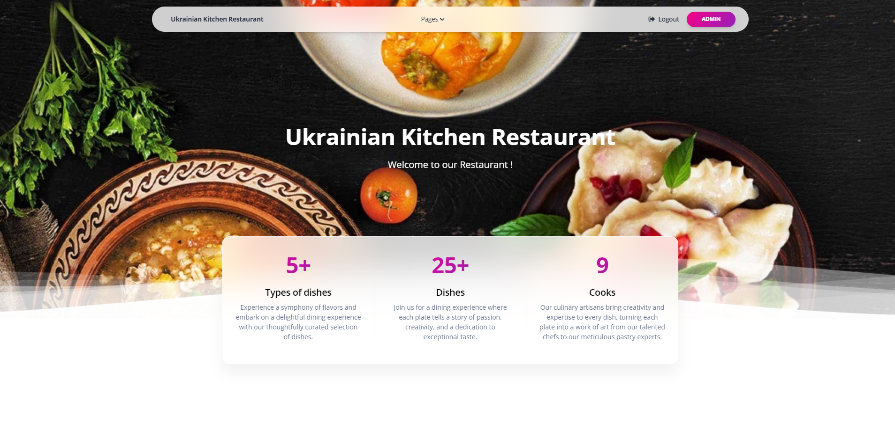
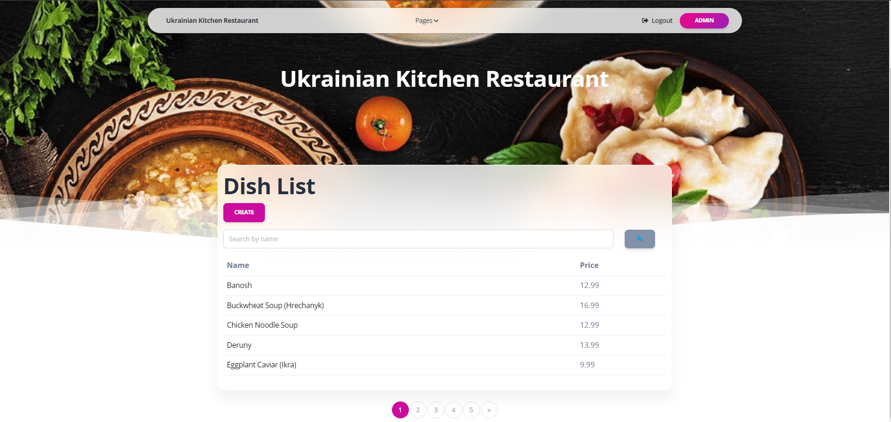
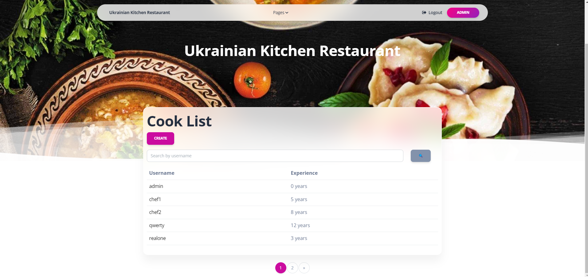

# py-website-kitchen-restaurant 
## How it works
Django project for restaurant kitchen management



It is a web-site for restaurants with ukrainian kitchen.
Using this web-site, it is easy to represent your restaurant`s menu to guests.

## Check it out!

[Kitchen restaurant project deployed to Render](https://kitchen-restaurant.onrender.com)

## Installing
#### Python3 must be already installed

_Set up the environment_

```
python -m venv venv
venv\Scripts\activate (on Windows)
source venv/bin/activate (on macOS)
```
_Set up requirements_
```
pip install -r requirements.txt
```
_Set up database_

_Use following command to load data from database_ 

`python manage.py loaddata kitchen_restaurant_data.json`

_Use following command to run server_

`python manage.py runserver`

### Log in
You can use below credentials to login:

username: `admin`

password: `1qazcde3`

Or you can create your own superuser using following command:

`python manage.py createsuperuser`

## Features

With this project you can interact with such models as: Dish types, Dishes, Cooks.

There are three pages with build in search, pagination and such operation as create, update, delete on every model.

There is detailed information about every dish type, dishes and cooks


## Demo








