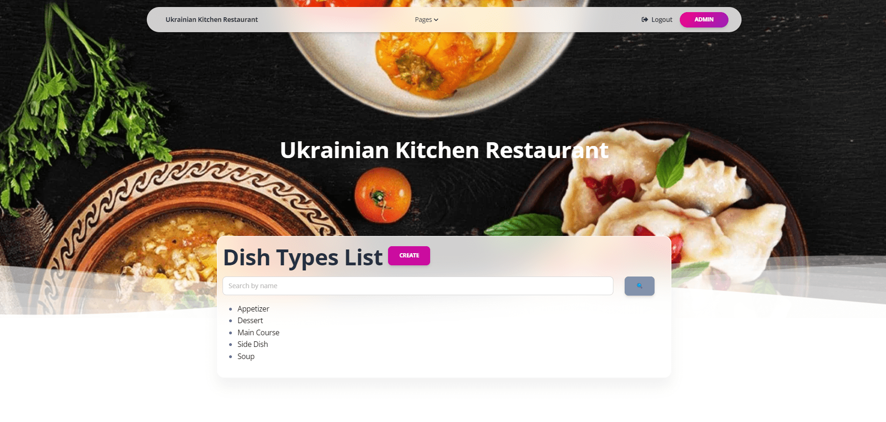

# py-website-kitchen-restaurant 
## How to install

1) Open Terminal and open folder to clone project in.

2) Clone repository into a desirable folder:

    ```
    git clone https://github.com/RabenkoYevhenii/py-website-kitchen-restaurant.git
    ```

3) Open cloned folder in terminal

4) If you don't have **pip** installed  [install it here](https://pip.pypa.io/en/stable/installation/#).

5) Create and activate **Virtual environment**:
   
   **Windows**
   ```
   python -m venv venv
   venv\Scripts\activate
   ```
   
   **MacOS**
   ```
   python3 -m venv venv
   source venv/bin/activate
   ```
   
6) Open cloned folder and install needed requirements using:


    `pip install -r requirements.txt`


7) Make migrations and migrate:

   `python manage.py makemigrations`

   `python manage.py migrate`


8) Install database fixture:

   `python manage.py loaddata kitchen_restaurant_data.json`

9) Run server:

   `python manage.py runserver`


10) Go to [http://127.0.0.1:8001/](http://127.0.0.1:8001/)

## How it works
Django project for restaurant kitchen management


### Log in
You can use below credentials to login:

username: `admin`

password: `1qazcde3`

Or you can create your own superuser using following command:

`python manage.py createsuperuser`

## Features

With this project you can interact with such models as: Dish types, Dishes, Cooks.

There are three pages with build in search, pagination and such operation as create, update, delete on every model.

There is detailed information about every dish type, dishes and cooks


## Demo





