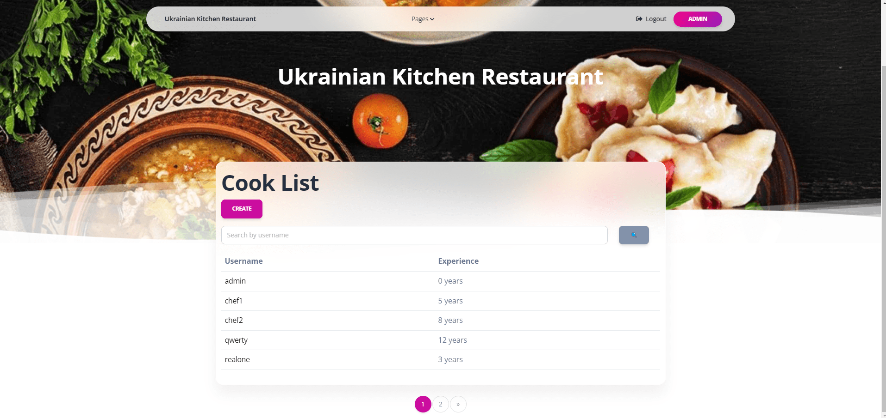

# py-website-kitchen-restaurant 
## How to install

1) Open Terminal and open folder to clone project in.

2) Clone repository into a desirable folder:

    ```
    git clone https://github.com/mykolamateichuk/django-it-company-task-manager.git
    ```

3) Open cloned folder in terminal

4) If you don't have **pip** installed  [install it here](https://pip.pypa.io/en/stable/installation/#).

5) Create and activate **Virtual environment**:
   
   **Windows**
   ```
   python -m venv venv
   venv\Scripts\activate
   ```
   
   **MacOS**
   ```
   python3 -m venv venv
   source venv/bin/activate
   ```
   
6) Open cloned folder and install needed requirements using:


    `pip install -r requirements.txt`


7) Make migrations and migrate:

   `python manage.py makemigrations`

   `python manage.py migrate`


8) Install database fixture:

   `python manage.py loaddata kitchen_restaurant_data.json`

9) Run server:

   `python manage.py runserver`


10) Go to [http://127.0.0.1:8001/](http://127.0.0.1:8001/)

## How it works
Django project for restaurant kitchen management


### Log in
You can use below credentials to login:

username: `admin`

password: `1qazcde3`

Or you can create your own superuser using following command:

`python manage.py createsuperuser`

### Main page
On the main page you can see basic information about available records counts:
types of dishes, dishes and cooks.


### All Dish types

On page "all dish types" you can find available dish types.

Also you can create own by pressing button create.

There is search form, fulling which can return to you specific results according to your request.


By pressing on dish type you will be redirected to page with detailed information about dish type.

### All dishes

It is page with the same logic as dish types, but information is declared in table form. 


There works search and detailed info by pressing as well.

### Cook list
This page has similar logic as previous.




